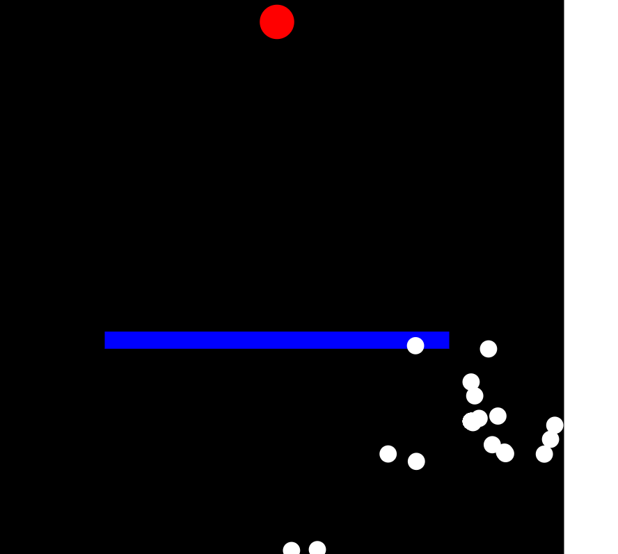

# elm-genetic

Moved from piotrg18 repo

## 

Example of implemented Genetic Algorithm using Elm language

## Instructions:

1.  You need nodejs
1.  npm install elm version 0.18.0
2.  next run  elm reactor
