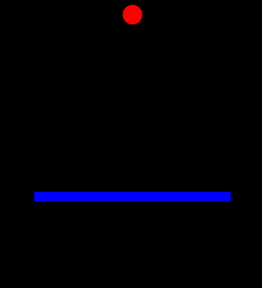

# elm-genetic

Moved from piotrg18 repo

## 

Example of implemented Genetic Algorithm using Elm language

## Demo 

## Instructions:

1. You need nodejs
2. npm install elm version 0.18.0 
3. next run  elm reactor
4. Navigate to src folder and double click on Main.elm
